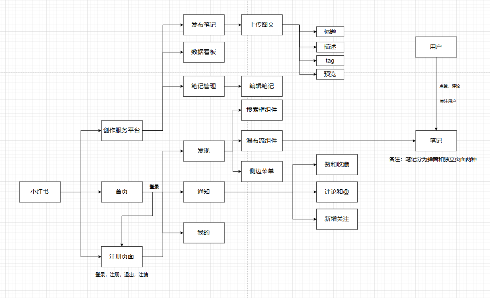
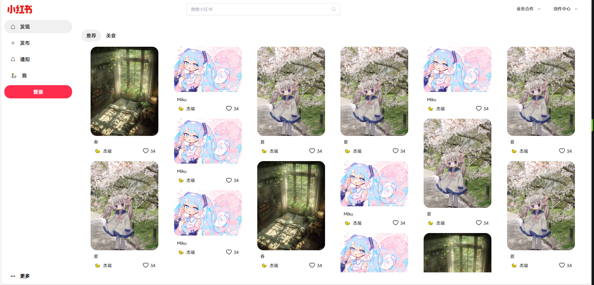
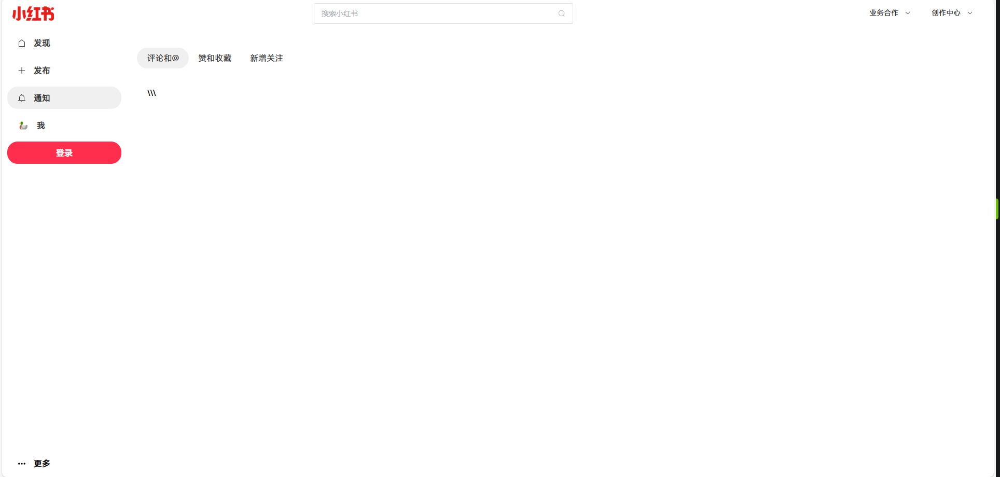
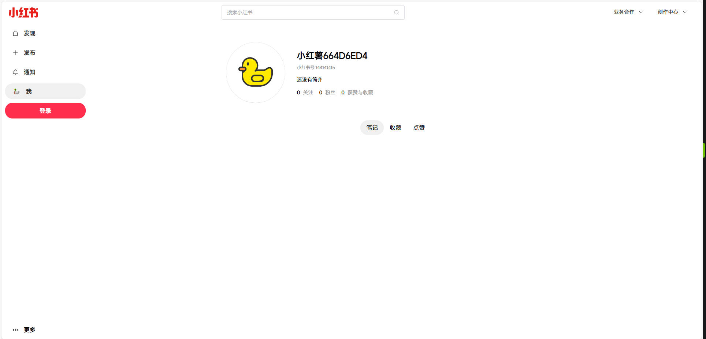
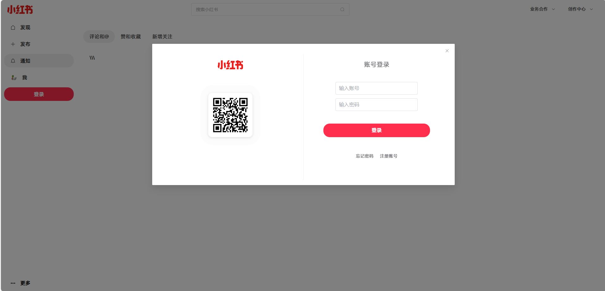
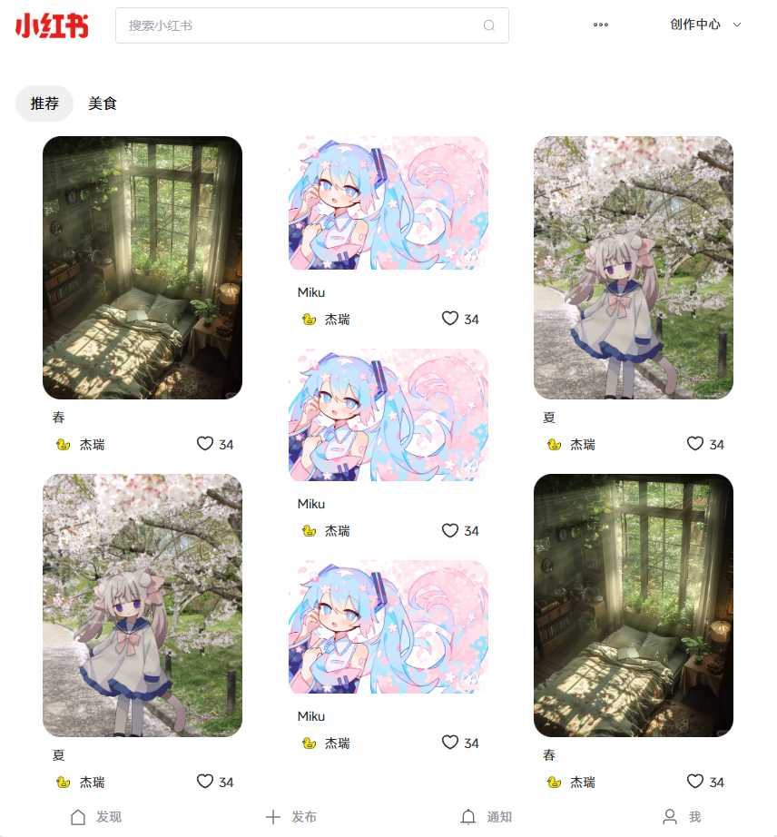
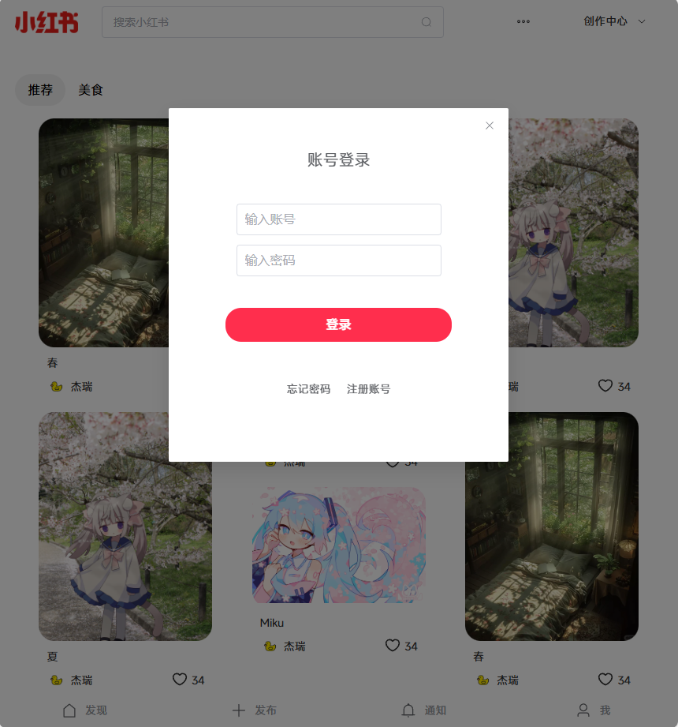
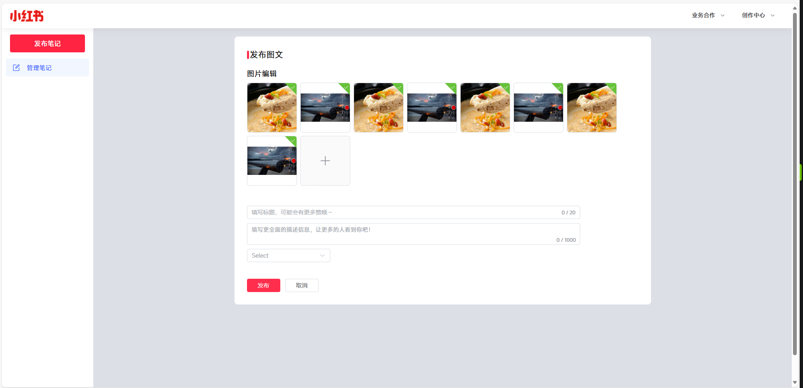
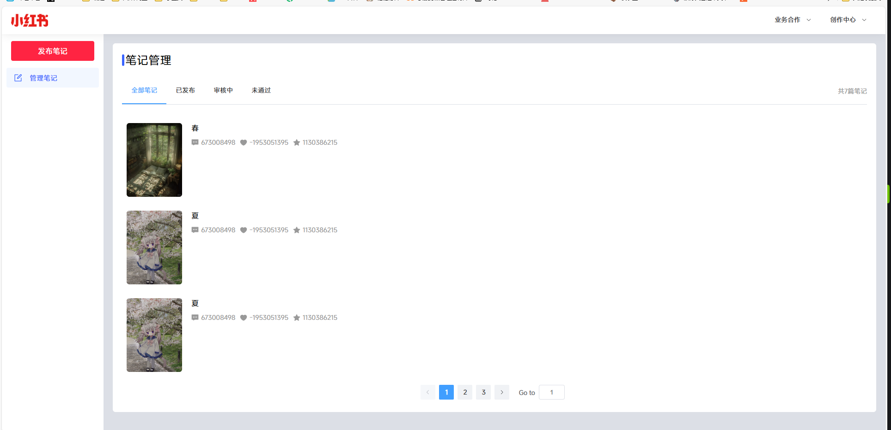
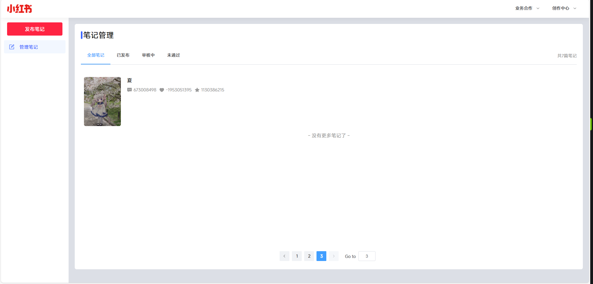

# 小红书(前端部分)

本项目为仿照小红书写的笔记交流网站，仅为前端部分，用于项目实训的课程设计。

### 目录

- [如何使用](#如何使用)
  - [本地部署](#本地部署)
  

- [任务](#任务)
- [预览](#预览)

## 如何使用

##### 本地部署

首先，电脑上要安装最新版的npm和node环境

1. Fork 并 Clone 代码到本地
2. 进入项目目录，运行`npm install`安装项目依赖
3. 安装完成依赖后，运行`npm run dev`即可启动项目，默认在`localhost:5173`端口启动
4. 如果需要编译项目，运行`npm run build`即可编译项目，编译后会在当前目录下生成`dist`文件夹

## 任务
- [x] 笔记管理页面高度问题

- [ ] 为每个页面适配移动端
- [ ] “我的”页面每个笔记的样式
- [ ] “通知”页面每个通知的样式
- [ ] 添加登录路由守卫 
- [ ] 优化瀑布流组件
- [ ] 添加笔记管理子路由
- [ ] 添加注册页面

## 难点

- 笔记页面的动态路由
- 用于登录的路由守卫
- 首页瀑布流组件展览笔记

## 预览

#### 思维导图

#### 首页

###### 发现

###### 通知

###### 我的

###### 登录

###### 页面小于950px时

首页部分

------

登录界面

#### 发布页面

##### 发布笔记

##### 管理笔记

